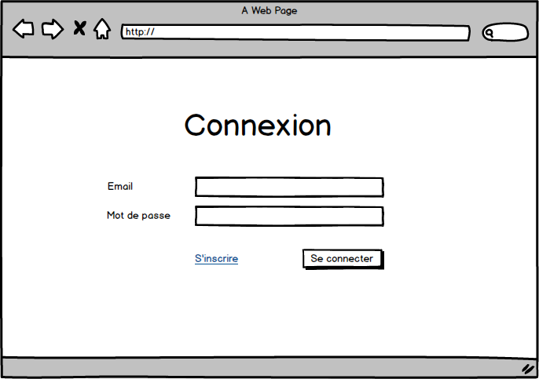

# Mini-projet Spring Security

## Objectif

L'objectif de cet exercice est de valider la compréhension des concepts Spring Security à travers la mise en œuvre d'une application complète (front + back).

Le back sera une application Spring (avec Spring Security) avec un accès à une base de données relationnelle (MySQL, PostGreSQL, ...)

Le front peut être écrit avec la technologie de votre choix (JavaScript, React, Vue, Angular, ...).

## Mise en place

* Créer un Fork du projet
* Ajouter **roddet** comme collaborateur

## Avancement

Veuillez cocher les cases ci-dessous pour notifier les pages qui fonctionnent dans votre projet.

* [x] Page Inscription
 - Valider deux fois l'inscription à cause du csrf 
* [x] Page Connexion
 - Valider deux fois la connexion à cause du csrf 
* [x] Page Mes informations
* [ ] Page Liste des utilisateurs (Delete ok) 

## Les pages

Un utilisateur peut avoir les rôles suivants :
* Utilisateur
* Gestionnaire
* Administrateur

L'application sera constituée de 4 pages :

### Page Inscription (accessible sans authentification). 

Le rôle "Utilisateur" est automatiquement affecté.

### Page Connexion (accessible sans authentification)

### Page Mes Informations (accessible uniquement à un utilisateur authentifié)

### Page Liste des utilisateurs (accessible uniquement à un utilisateur authentifié ayant le rôle de gestionnaire). 

* Le lien "Liste des utilisateurs" du menu est à griser si l'utilisateur n'est pas gestionnaire.
* Le bouton de suppression et la modification du profil ne sont accessibles que si l'utilisateur connecté est administrateur. 

